# Makeup Engine 图文版操作说明书

> 面向对象：项目老板、产品负责人、内部试用管理员。  
> 本文档不是终端用户说明书，也不是正式 App 发布说明。  
> 当前仓库 source of truth：Phase 9C 已完成，下一建议阶段是 Phase 9D。

## 1. 这个系统是做什么的

Makeup Engine 是妆容模板生产和内部试用准备系统。它可以在浏览器里本地运行，用来管理模板生产、视觉分析、模板库、用户侧模板包、PWA/Mobile Web MVP Shell、内部试用任务、反馈结构、内容 QA、发布就绪 gate、试用运营、试用结果复盘和下一轮迭代计划。

它当前不是正式 App，不是 App Store/TestFlight 发布，不接后端，不收集真实用户照片，不训练模型。

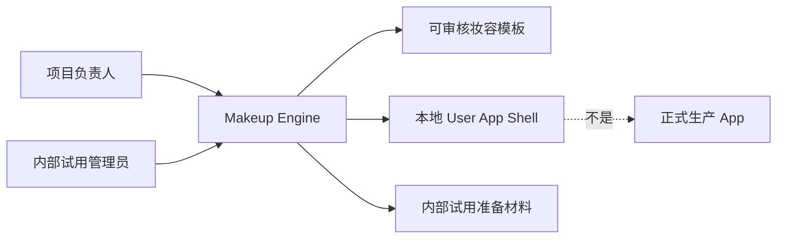

## 2. 如何启动项目

在 MacBook 上固定进入项目目录：

```bash
cd /Users/star/Makeup-Engine
npm install
npm run dev
```

终端会显示本地地址，例如：

```text
http://localhost:5173/
```

打开后可以看到视觉分析和模板工作台入口。

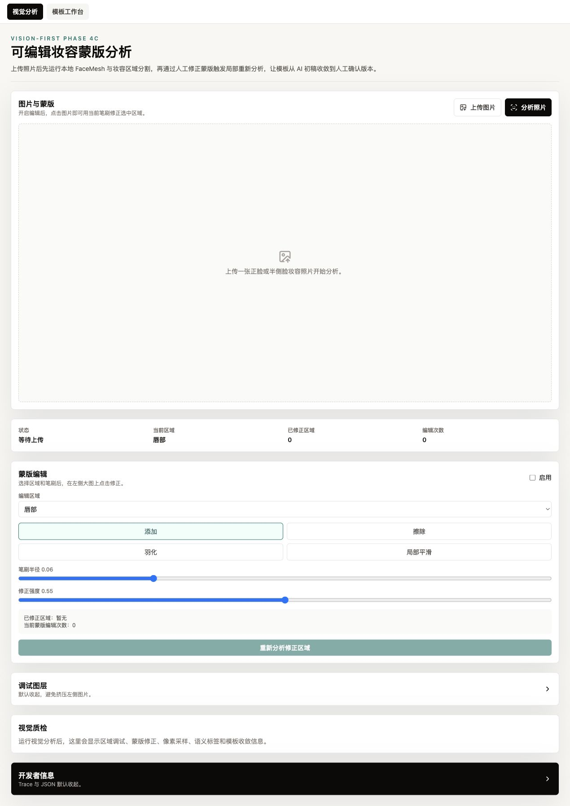

日常验证命令：

```bash
npm run project:status
npm run project:context
npm run typecheck
npm run build
npm run test
npm run user-app:browser-qa -- --json
node scripts/project-status.mjs --json
node scripts/context-pack.mjs --json
```

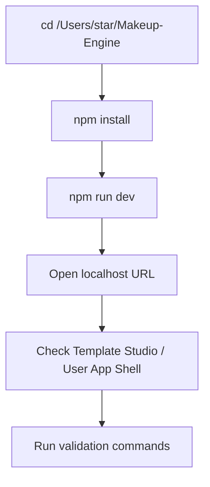

## 3. 推荐日常工作目录

后续固定使用：

```text
/Users/star/Makeup-Engine
```

不要把 Codex worktree 临时目录当成主要项目目录。临时目录适合工具运行或中转，但项目状态、Git 分支、文档、测试和提交都应回到固定目录确认。

## 4. 分支工作流

每个 Phase 或独立文档任务应新建分支，完成后 commit 并 push 到 GitHub。不要直接在 `main` 上堆功能，不要 `git add -A`，不要提交 `dist`、`node_modules`、`tmp`、`.test-dist`、`.vite`、`coverage` 或 `public/mediapipe`。

当前 GitHub 仓库：

```text
https://github.com/Shidawow/Makeup-Engine
```

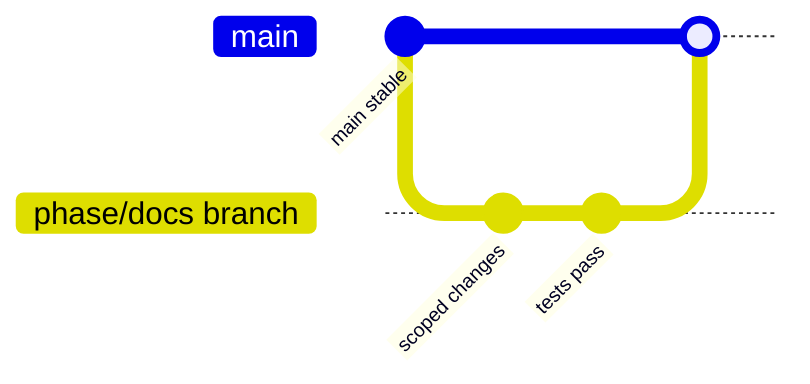

提交前确认：

```bash
git branch --show-current
git remote -v
git status
```

## 5. 如何查看当前项目状态

优先查看这些 source-of-truth 文件：

- `START_HERE.md`
- `docs/status/CURRENT_PROJECT_STATUS.md`
- `docs/status/NEXT_ACTION.md`
- `project-state/project-state.snapshot.json`
- `project-state/latest-handoff.json`

命令：

```bash
npm run project:status
npm run project:context
node scripts/project-status.mjs --json
node scripts/context-pack.mjs --json
```

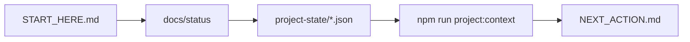

## 6. Template Studio 使用说明

Template Studio 是管理员工作台。入口名称以实际 UI 为准，当前主入口为“模板工作台”。


典型流程：

1. 进入“模板工作台”。
2. 使用 Source Image Intake 导入或加载 source image manifest。
3. 创建 `TemplateAnalysisSeed` 后进入 Vision Analysis。
4. 使用 Overlay Debug 查看检测与区域信息。
5. 使用 Editable Mask Workbench 修正蒙版。
6. 使用 Evidence Panel 查看证据。
7. 使用 Dataset Panel / Review Queue / Replay Viewer 做审核与复盘。
8. 进入 Template Library 管理模板。
9. 构建 Publish Package。
10. 查看 Package Preview。
11. 用 User App Prototype Consumer 验证消费 contract。

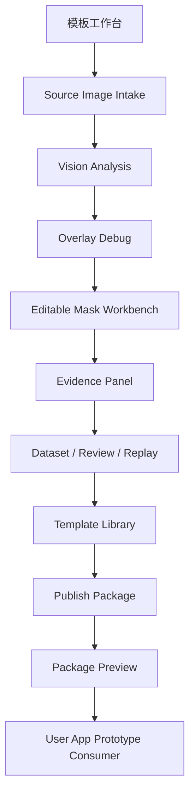

## 7. User App Shell 使用说明

User App Shell 是本地 PWA/Mobile Web MVP prototype，不是正式用户 App。

普通用户路径包括：

- 跟练
- 发现妆容
- 我的准备
- 我的偏好
- 照片占位
- 本地进度
- 隐私说明

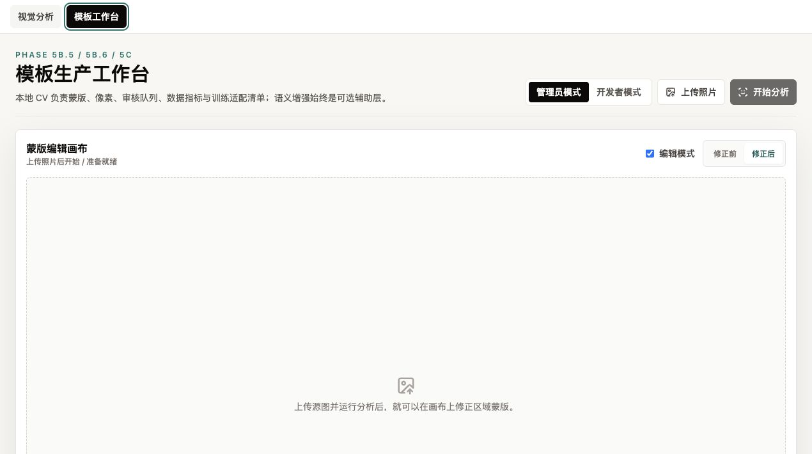

管理员路径包括：

- PWA 检查
- MVP 打磨
- App 就绪度
- 移动端 QA
- 交互检查
- MVP 试用包
- 反馈表预览
- 试用就绪度
- 模板内容 QA
- 试用模板选择
- 试用内容就绪度
- MVP 发布就绪度
- 试用 Go/No-Go
- 内部试用运营
- 观察记录模板
- 试用结果复盘
- 试用结果复盘框架
- 问题分类汇总
- 下一步决策框架
- 试用迭代计划
- 迭代 backlog
- 优先级建议


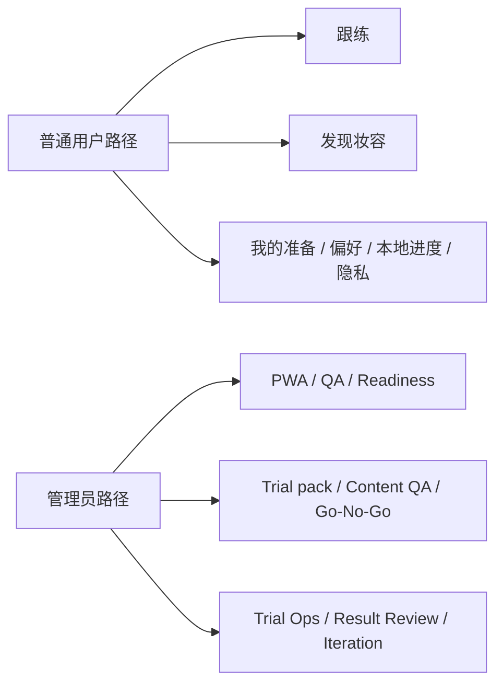

## 8. 如何准备内部小范围试用

内部试用准备必须先确认 Phase 8E readiness，再使用 Phase 9A 运营包。试用应选择 trial-ready templates，使用 trial pack、feedback questionnaire、content QA、go/no-go 和 trial result review。

整个过程不收集敏感信息，不要求用户上传照片，不把反馈用于训练，不写真实用户记录到 `project-state`。

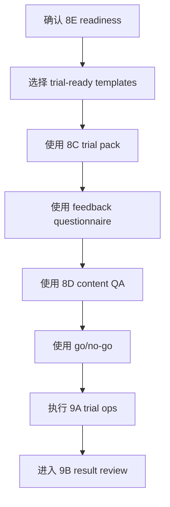

## 9. 如何复盘内部试用

复盘使用 Phase 9B Trial Result Review。先整理匿名/mock 观察信号，再分类问题，判断 severity / confidence / actionability，区分内容问题、Shell 问题、试用流程问题和隐私边界问题，最后输出下一步决策。

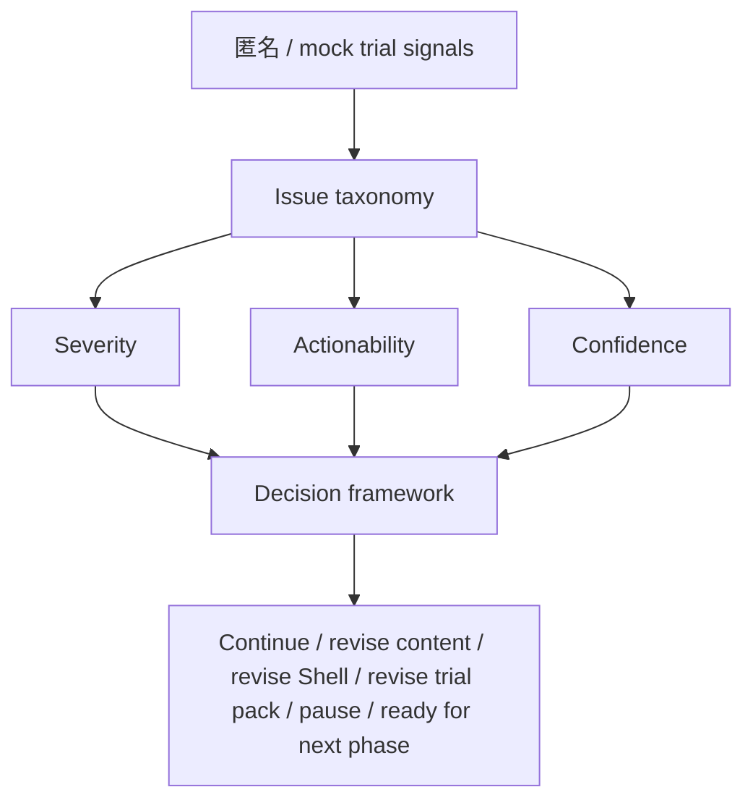

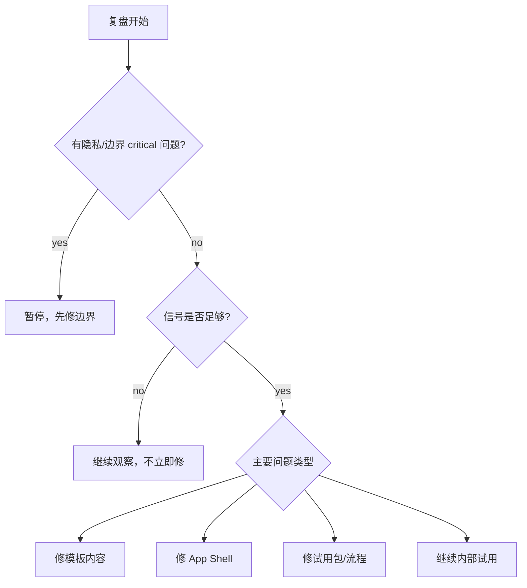

## 10. 可以做什么 / 不可以做什么

可以做：

- 本地运行。
- 查看模板。
- 体验跟练流程。
- 查看推荐占位。
- 查看 PWA readiness。
- 做内容 QA。
- 准备内部试用。
- 做试用复盘。
- 做内部试用迭代规划。

不可以做：

- 正式发布。
- 收集真实照片。
- 上线 App Store/TestFlight。
- 接后端或数据库。
- 调 OpenAI API 或 external API。
- 训练模型。
- 收集敏感资料。
- 把内部试用当成 public launch。

## 11. 常见问题

### 为什么不是 iOS App？

当前目标是先验证模板指导价值和移动 Web 流程。iOS native 会带来签名、审核、相机/AR、发布和维护成本，必须等未来显式 gate。

### 为什么先做 PWA？

React Web / PWA 能复用当前 React/Vite 和 `UserAppTemplatePackage` 经验，以最低平台成本验证发现、详情、跟练、偏好、本地进度和隐私文案。

### 能不能直接给用户用？

只能作为内部小范围、本地、受控试用准备材料。它不是 production app，也不是正式上线产品。

### 能不能收集照片？

不能。当前照片入口是占位，不请求 camera permission，不上传，不分析，不保存，不训练。

### 能不能接 OpenAI？

不能。当前范围明确 no OpenAI API / no external AI API / no AI analysis。

### `public/mediapipe` 为什么没有？

MediaPipe 本地资源属于需要单独准备的运行资源，不提交到仓库，避免大文件和运行环境耦合。

### build 有 chunk warning 是否严重？

当前 Vite chunk-size warning 是已知构建提示，不等于 build 失败。是否拆包应由未来明确性能阶段处理。

### full test 怎么跑？

```bash
npm run test
```

### Codex worktree 和 `/Users/star/Makeup-Engine` 有什么区别？

`/Users/star/Makeup-Engine` 是推荐固定项目目录。Codex worktree 可能是临时工作区，不应成为长期 source of truth。

### 如何确认代码已经 push 到 GitHub？

```bash
git branch --show-current
git remote -v
git status
git log -1 --oneline
```

然后确认 `git push -u origin <branch>` 成功。

### 为什么内部试用不等于正式发布？

内部试用只验证理解、跟练意愿、模板价值和边界清晰度。它不代表可规模化上线、合规完成、后端可用、App Store 可发或真实用户数据可收集。

### 什么情况下必须暂停试用？

出现隐私/边界 critical 问题时必须暂停，例如有人要求上传照片、收集姓名联系方式、记录健康/敏感身份、写入后端、调用 AI 分析、写入训练数据或把真实用户记录写进 `project-state`。

## 12. 后续工作

当前 Phase 9C 已完成 Internal Trial Iteration Plan。下一建议阶段是 Phase 9D Learning Summary & Product Decision Gate。后续是否继续做 production app、native app、backend、camera、AR 或真实试用数据系统，必须基于试用学习结果和新的显式 phase gate。

