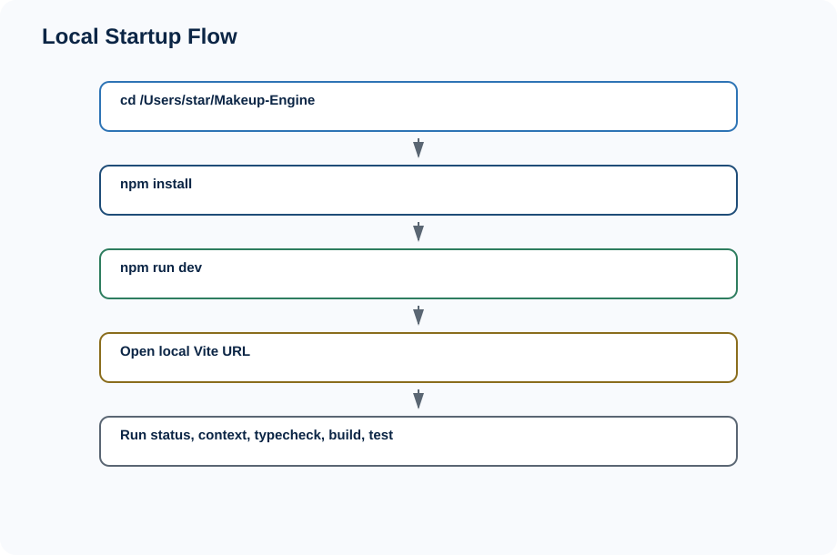
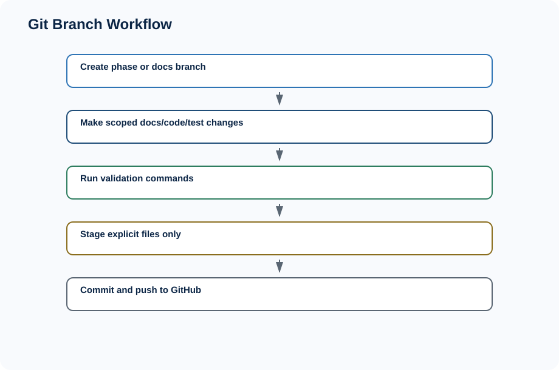
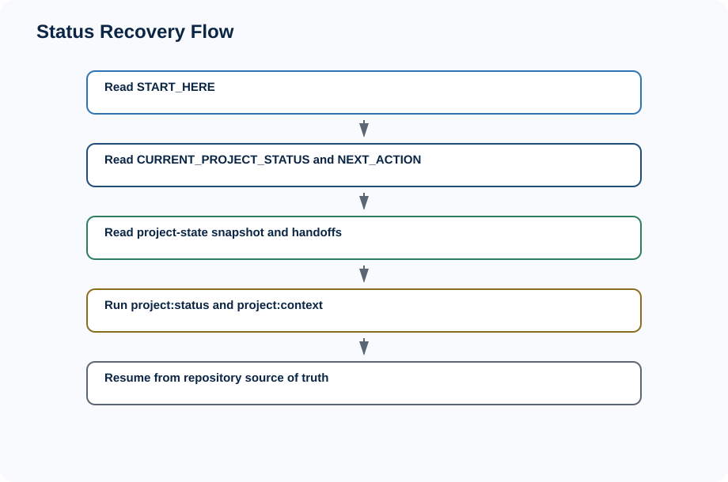
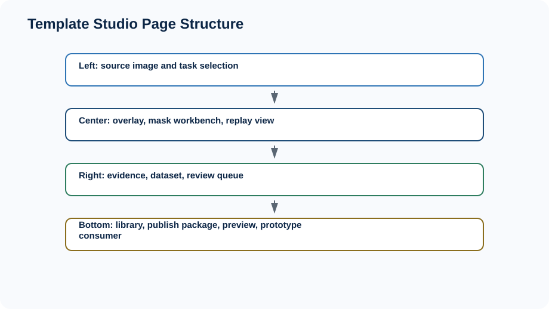
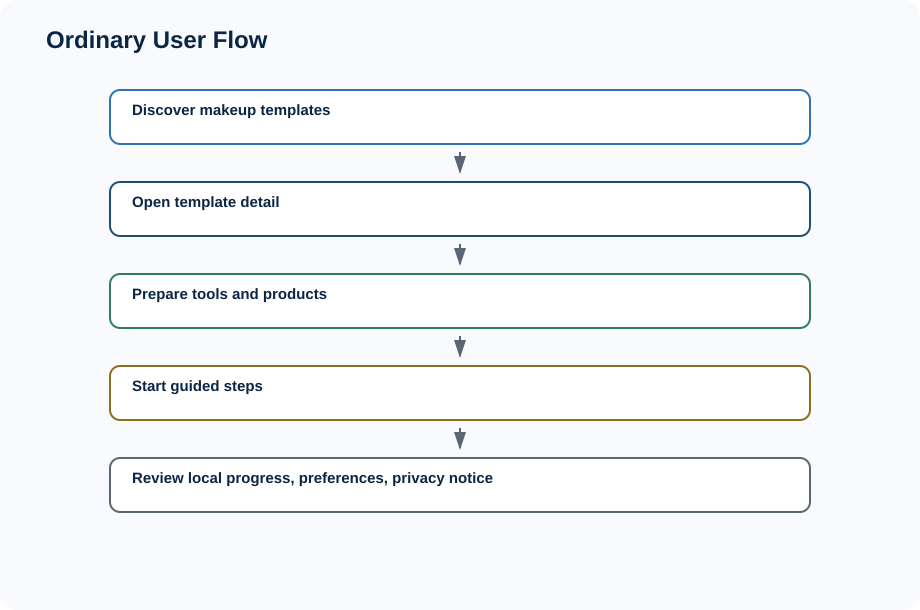
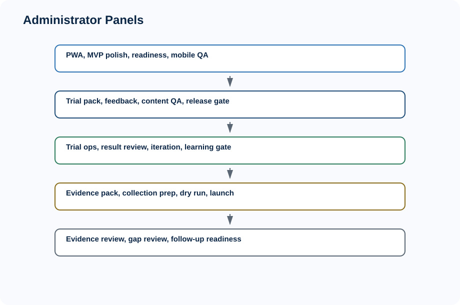
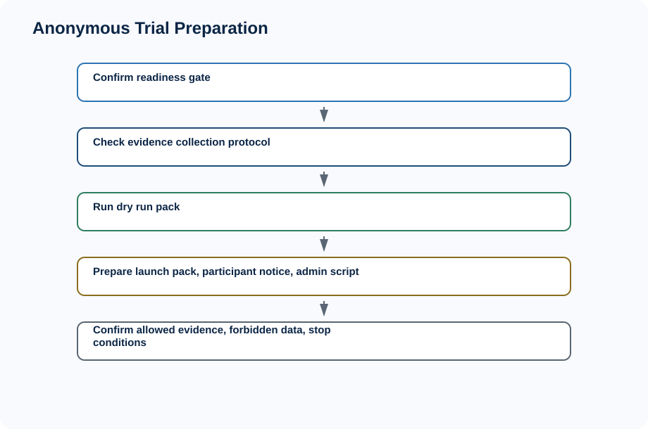
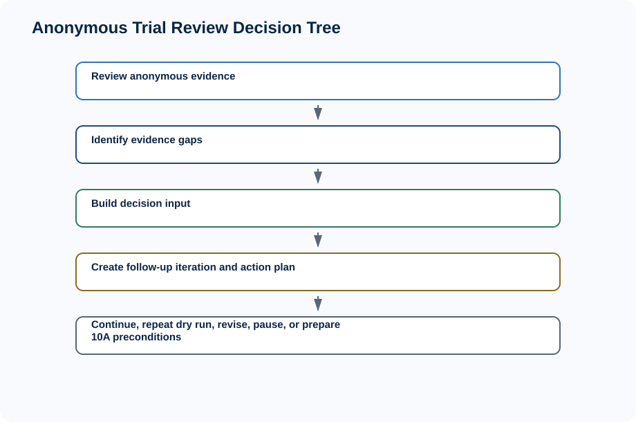

# Makeup Engine 图文版操作说明书


读者：项目老板 / 产品负责人 / 内部试用管理员


> 本次文档未采集真实界面截图，使用架构图、流程图和页面结构示意图替代。后续可在运行环境稳定后补充截图。


## 目录


- 1. 这个系统是做什么的
- 2. 如何启动项目
- 3. 推荐日常工作目录
- 4. 分支工作流
- 5. 如何查看当前项目状态
- 6. Template Studio 使用说明
- 7. User App Shell 普通用户路径
- 8. User App Shell 管理员路径
- 9. 如何准备匿名内部试用
- 10. 如何复盘匿名内部试用
- 11. 可以做什么 / 不可以做什么
- 12. 常见问题
- 13. 后续工作


## 1. 这个系统是做什么的

Makeup Engine 是模板生产和试用准备系统。它可以在浏览器本地运行，用于准备 PWA / Mobile Web MVP 和匿名内部试用。它不是正式 App，不是后端服务，也不是公开用户增长系统。


## 2. 如何启动项目

在 MacBook 上固定使用项目目录：

```bash
cd /Users/star/Makeup-Engine
npm install
npm run dev
```

浏览器打开终端显示的本地地址，例如 `http://localhost:5173/`。

常用验证命令：

```bash
npm run project:status
npm run project:context
npm run typecheck
npm run build
npm run test
npm run user-app:browser-qa -- --json
```




## 3. 推荐日常工作目录

日常固定使用 `/Users/star/Makeup-Engine`。不要主要依赖 Codex worktree 临时目录，因为长期状态、桌面交付、GitHub push 和项目恢复都应以这个主目录为准。


## 4. 分支工作流

每个 Phase 或独立文档任务新建分支，完成后 commit + push GitHub，不直接在 main 上堆功能。不要 `git add -A`，不要提交 `dist`、`node_modules`、`tmp`、`public/mediapipe`、`.DS_Store`。当前 GitHub 仓库是 https://github.com/Shidawow/Makeup-Engine。




## 5. 如何查看当前项目状态

优先查看 `START_HERE.md`、`docs/status/CURRENT_PROJECT_STATUS.md`、`docs/status/NEXT_ACTION.md`、`project-state/project-state.snapshot.json`、`project-state/latest-handoff.json`。

命令：

```bash
npm run project:status
npm run project:context
node scripts/project-status.mjs --json
node scripts/context-pack.mjs --json
```




## 6. Template Studio 使用说明

Template Studio 管理员路径包括 Source Image Intake、Vision Analysis、Overlay Debug、Editable Mask Workbench、Evidence Panel、Dataset Panel、Review Queue、Replay Viewer、Template Library、Publish Package、Package Preview、User App Prototype Consumer。入口名称以实际 UI 为准。




## 7. User App Shell 普通用户路径

普通用户路径聚焦：发现妆容、查看妆容详情、准备工具、开始跟练、逐步查看步骤、查看本地进度、查看本地偏好、查看隐私说明。普通用户路径不展示 trial ops、evidence review、follow-up readiness 等管理员术语。




## 8. User App Shell 管理员路径

管理员路径用于 QA、试用准备、证据复盘和后续迭代，不是普通用户功能。当前管理员入口包括：

- PWA 检查
- MVP 打磨
- App 就绪度
- 移动端 QA
- 交互检查
- MVP 试用包
- 反馈表预览
- 试用就绪度
- 模板内容 QA
- 试用模板选择
- 试用内容就绪度
- MVP 发布就绪度
- 试用 Go/No-Go
- 内部试用运营
- 观察记录模板
- 试用结果复盘
- 试用结果复盘框架
- 问题分类汇总
- 下一步决策框架
- 试用迭代计划
- 迭代 backlog
- 优先级建议
- 试用学习总结
- 产品决策门
- 下一阶段建议
- 内部试用证据包
- 试用证据摘要
- 证据充分性判断
- 证据收集协议
- 证据收集 checklist
- 证据收集质量门
- 匿名内部试用 dry run
- dry run checklist
- dry run 复盘
- 匿名内部试用启动包
- 启动就绪度
- 试用后 handoff
- 匿名试用证据复盘
- 证据缺口复盘
- 下一步决策输入
- 匿名试用后续迭代
- 证据缺口行动计划
- 后续试用就绪度




## 9. 如何准备匿名内部试用

准备匿名内部试用时，先确认 readiness gate，再使用 9F evidence collection protocol、9G dry run pack、9H launch pack，并确认 participant notice、admin script、allowed evidence、forbidden data、stop conditions。




## 10. 如何复盘匿名内部试用

复盘时使用 9I evidence review、evidence gap review、decision input，再使用 9J follow-up iteration 判断是否继续匿名内部试用、重复 dry run、修 protocol、修 launch pack、暂停或准备 MVP validation preconditions。




## 11. 可以做什么 / 不可以做什么

可以做：本地运行、查看模板、跟练流程、查看推荐、查看 PWA readiness、做内容 QA、准备匿名内部试用、做匿名证据复盘、做后续迭代计划。

不可以做：正式发布、公开招募、收集真实照片、收集真实姓名 / 手机 / 邮箱、收集健康信息 / 敏感身份 / 生物识别、上线 App Store、接后端、调 OpenAI API、训练模型、收集敏感资料。


## 12. 常见问题

**为什么不是 iOS App？** 当前路线是 React Web / PWA MVP first，原生 iOS 等待后续明确 gate。

**为什么先做 PWA？** PWA 能更快验证模板价值、移动端路径和内部试用流程。

**能不能直接给用户用？** 只能用于内部小范围匿名试用准备，不是正式发布。

**能不能收集照片？** 不能。当前 photo 是 placeholder，不调用 camera API。

**能不能接 OpenAI？** 当前不能接 OpenAI API 或外部 AI/CV API。

**public/mediapipe 为什么没有？** 这是 intentionally not committed 的本地资源，需要单独准备。

**build 有 chunk warning 是否严重？** 当前是 Vite 大 chunk 提醒，不等于失败。

**full test 怎么跑？** 使用 `npm run test`。

**Codex worktree 和 /Users/star/Makeup-Engine 有什么区别？** 日常交付以 `/Users/star/Makeup-Engine` 为准。

**如何确认代码已经 push 到 GitHub？** 查看 `git status`、`git branch --show-current`、`git remote -v`，并确认 push 输出成功。

**为什么内部试用不等于正式发布？** 内部试用只验证理解、跟练意愿和模板价值，不开放公开增长。

**什么情况下必须暂停试用？** 发现照片、上传、真实身份、敏感信息、训练或后端记录请求时必须暂停。

**为什么现在不继续堆 Phase 9K？** 当前任务是补正式图文文档和操作说明，先沉淀系统全貌。

**为什么需要先补图文详细设计书和操作说明书？** 方便老板、产品负责人和内部试用管理员理解边界、流程和下一步决策。


## 13. 后续工作

DOC-ILLUSTRATED 本次完成后，后续可以进入 Phase 10A MVP Validation Plan 或按证据策略进入 Phase 9K Anonymous Internal Trial Evidence Round 2 Pack。是否继续 production app discovery，应由匿名内部试用证据和明确产品验证指标决定。

