# Makeup Engine 图文版详细设计书

版本：Phase 9J 后 | 输出：DOC-ILLUSTRATED | 仓库：https://github.com/Shidawow/Makeup-Engine

> 本次文档未采集真实界面截图，使用架构图、流程图和页面结构示意图替代。后续可在运行环境稳定后补充截图。

## 目录

- 1. 项目概述
- 2. 总体目标
- 3. 系统总体架构
- 4. 核心数据流
- 5. Vision-first 管线设计
- 6. Template Studio 设计
- 7. Template / App Contract 设计
- 8. User App Shell 设计
- 9. 匿名内部试用体系设计
- 10. 隐私与安全边界
- 11. 当前不做事项
- 12. 当前已知限制
- 13. 测试与质量保障
- 14. 项目状态恢复机制
- 15. 后续路线

## 1. 项目概述

Makeup Engine 是妆容模板生产系统，用于把可审核的视觉分析、人工修正、模板证据、模板库和发布包组织成未来用户侧 App 可以消费的模板契约。User App Shell 是本地 contract-driven PWA / Mobile Web prototype，用于验证 UserAppTemplatePackage 的消费路径、移动端体验和匿名内部试用准备。

当前路线是 React Web / PWA MVP first。当前不是 production app，也不做 iOS 原生、React Native、Flutter、后端、数据库、账号、相机、AR、OpenAI API、训练或 App Store 发布。

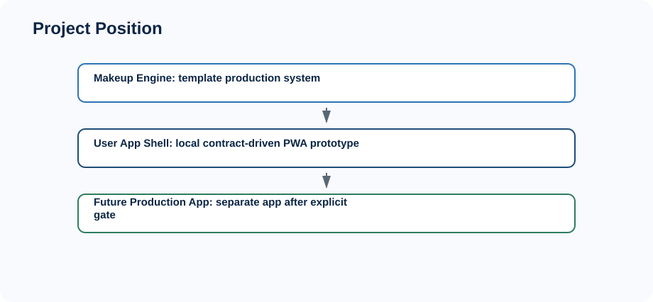

## 2. 总体目标

总体目标是建立可解释、可审核、可发布的妆容模板生产体系，并用 UserAppTemplatePackage 作为未来用户侧 App 的消费契约。当前能力覆盖 PWA / Mobile Web MVP Shell、匿名内部试用准备、证据复盘和 Phase 9J 后续迭代规划。

关键目标：

- 模板生产链路可追溯：来源、分析、修正、证据、QA、发布包均可审计。
- 用户侧消费契约稳定：UserAppTemplatePackage 经过本地 JSON round-trip 和 compatibility validation。
- 试用决策保守：内部试用只使用匿名、本地、示例级或安全内部证据，不直接推导生产发布。

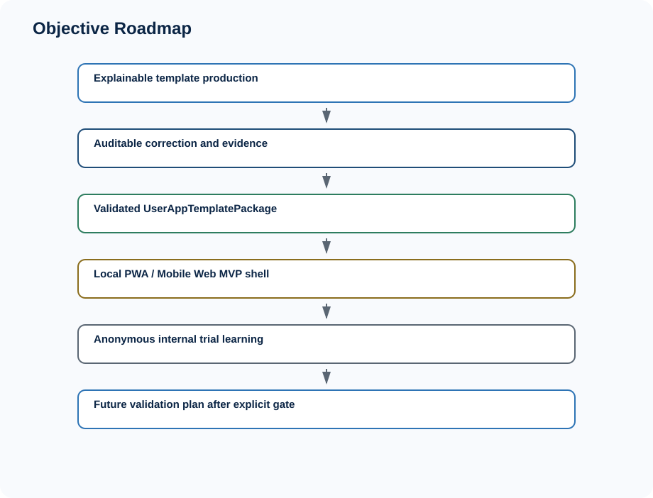

## 3. 系统总体架构

系统由 Vision subsystem、Template Studio、Template Library、Template Production Batch、Template Publish Package、UserAppTemplatePackage、User App Shell prototype、Trial Pack、Content QA、Release Readiness Gate、Internal Trial Operations、Evidence Collection、Dry Run、Launch Pack、Evidence Review、Follow-up Iteration、Project state / recovery docs 组成。

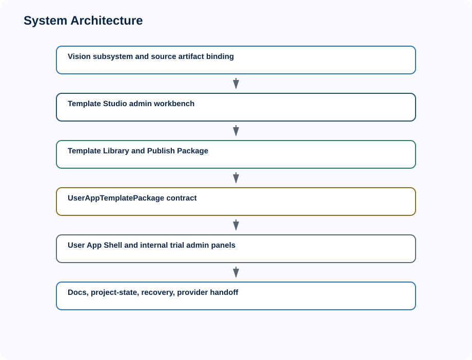

模块关系的核心原则是：Makeup Engine 负责模板生产和本地验证；User App Shell 负责读取契约并模拟未来 PWA/Mobile Web 用户体验；未来 production app 必须等待新的明确 phase gate。

## 4. 核心数据流

Source image / manual template input 进入 vision analysis 后，产生 cosmetic regions、segmentation foundation、weighted sampling、makeup parameters 和 semantics。随后 template builder 生成模板草案，经过 template QA、correction、evidence、Template Library，再导出 UserAppTemplatePackage，最后由 User App Shell 消费，并进入 trial pack、feedback、content QA、release readiness、trial ops、evidence、dry run、launch、review 和 follow-up。

关键边界：

- SourceImagePackage 不能直接进入 User App。
- SourceImagePackage 不是 training dataset。
- UserAppTemplatePackage 是消费契约，不是在线发布物。
- User App Shell 不能直接读取 SourceImagePackage。

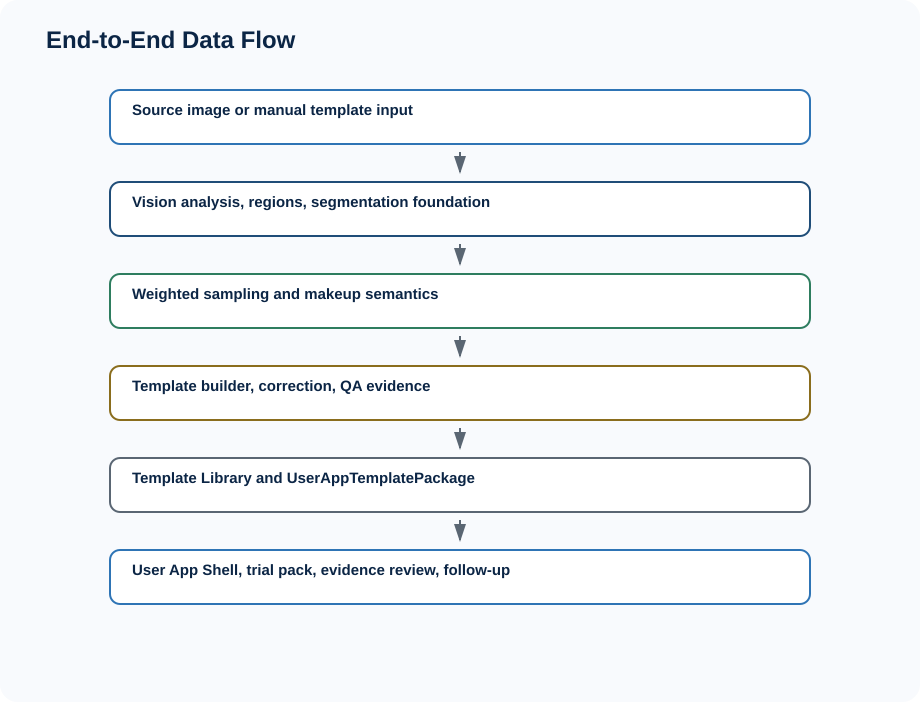

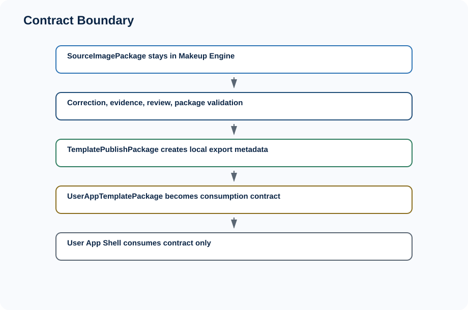

## 5. Vision-first 管线设计

Vision-first 管线覆盖 Face detection / landmarks、MediaPipe FaceMesh provider、cosmetic regions、segmentation foundation、weighted pixel sampling、skin baseline / edge analysis、editable mask、correction persistence、dataset export / review queue、PNG image codec / artifact manifest。

当前限制包括：未接真实深度学习 segmentation model；JPEG decode intentionally unsupported；`public/mediapipe` 需要单独准备且不提交；当前主要是本地分析和可审核证据链。

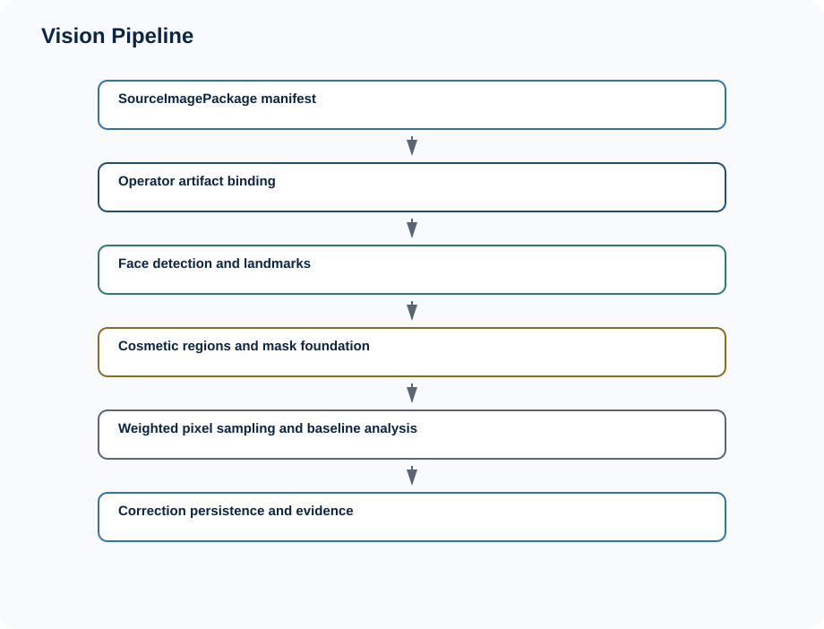

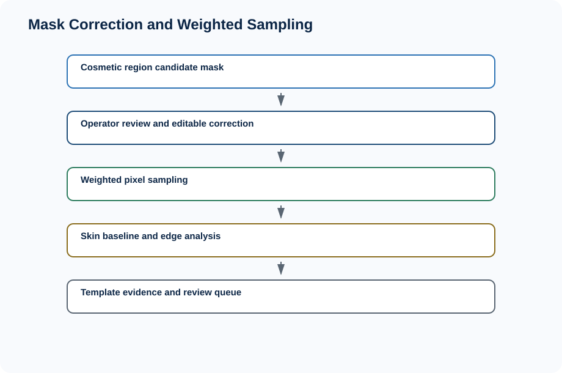

## 6. Template Studio 设计

Template Studio 是本地管理员工作台，覆盖 Source Image Intake、Vision Analysis、Overlay Debug、Editable Mask Workbench、Evidence Panel、Dataset Panel、Review Queue、Replay Viewer、Template Library、Publish Package、Package Preview 和 User App Prototype Consumer。

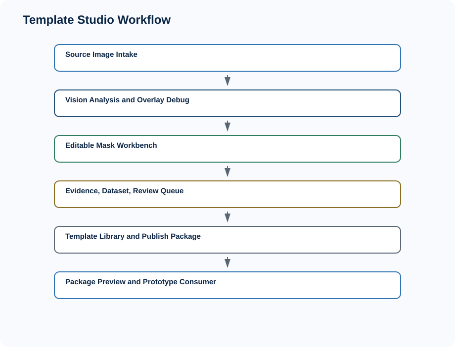

## 7. Template / App Contract 设计

核心 contract 包括 MakeupTemplate、TemplateEvidence、HumanCorrectionDataset、TemplateLibraryEntry、TemplatePublishPackage、UserAppTemplatePackage。契约层要求 compatibility validation、durable export 不含 object URL / local path / image bytes / React state，并保持 JSON round-trip stability。

UserAppTemplatePackage 是 Makeup Engine 与未来用户侧 App 的消费边界。它可以被 User App Shell 读取，但不能反向修改模板生产状态。

## 8. User App Shell 设计

User App Shell 是 local PWA / Mobile Web MVP Shell，覆盖 template list / detail、step-by-step guidance、tools / product suggestions、local onboarding、local preferences、local session persistence、discovery / recommendation placeholder、photo / personalization placeholder、privacy notice、PWA readiness、mobile web polish、browser/mobile QA、trial pack、content QA、release readiness gate、internal trial ops、evidence collection、dry run、launch pack、evidence review 和 follow-up iteration。

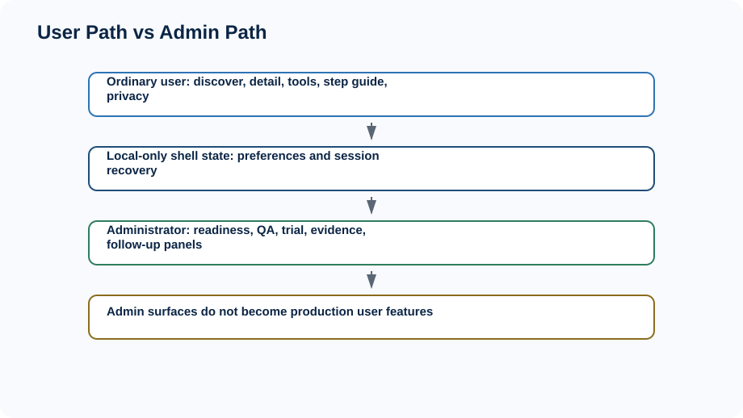

## 9. 匿名内部试用体系设计

内部试用体系从 Phase 8C 到 Phase 9J 逐步形成闭环：8C User App MVP Trial Pack、8D Template Content QA、8E MVP Release Readiness Gate、9A Internal Trial Operations、9B Trial Result Review、9C Trial Iteration Plan、9D Learning Summary & Decision Gate、9E Internal Trial Evidence Pack、9F Evidence Collection Preparation、9G Anonymous Dry Run Pack、9H Anonymous Trial Launch Pack、9I Anonymous Trial Evidence Review、9J Follow-up Iteration。

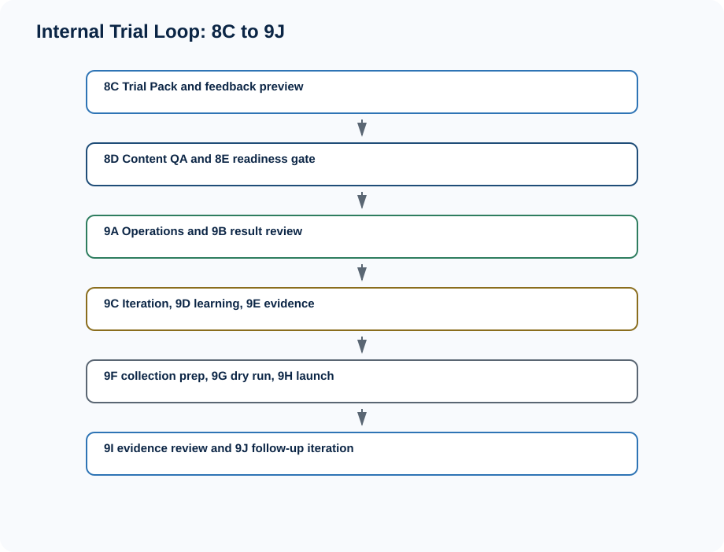

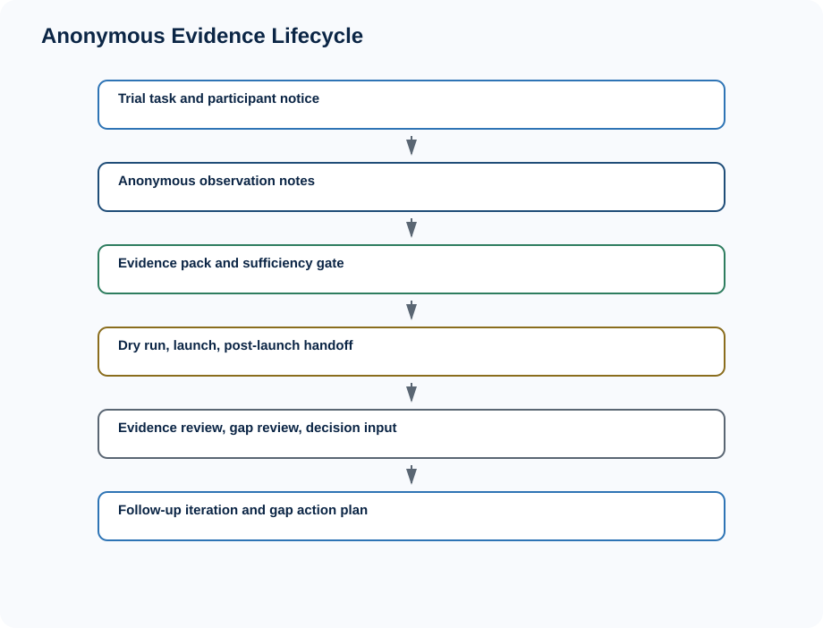

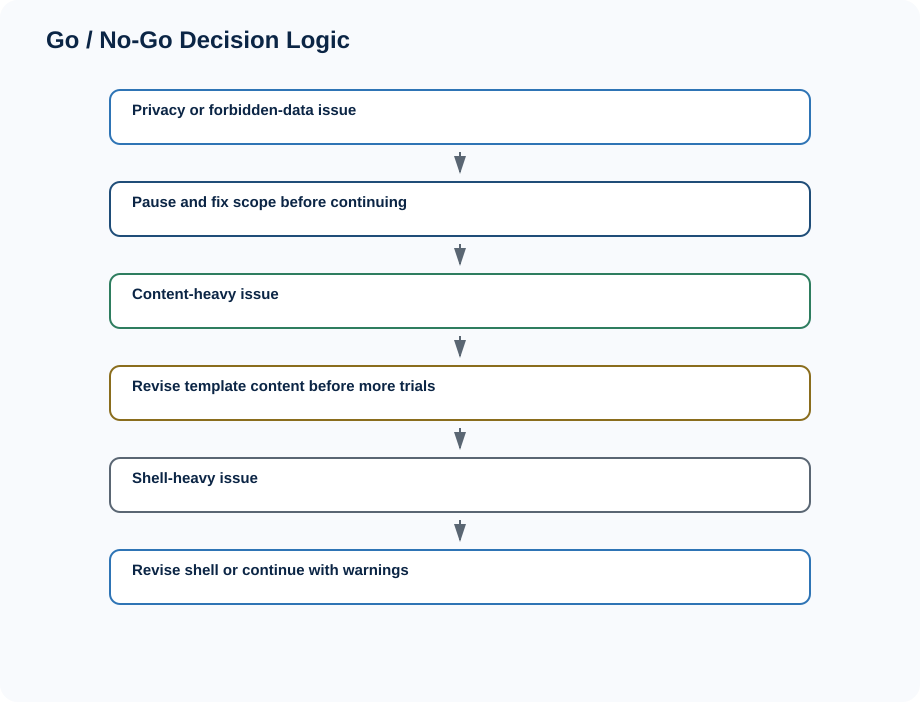

## 10. 隐私与安全边界

隐私边界是当前体系的硬约束：不采集真实照片；不上传照片；不保存 image bytes、base64、object URL、本地路径；不保存 faceEmbedding / biometricId；不收集健康信息、敏感身份信息、精确身份信息；不写真实用户记录到 project-state；不写 trial feedback 到 training dataset；不调用 OpenAI API / external API；不做 backend / database / analytics。

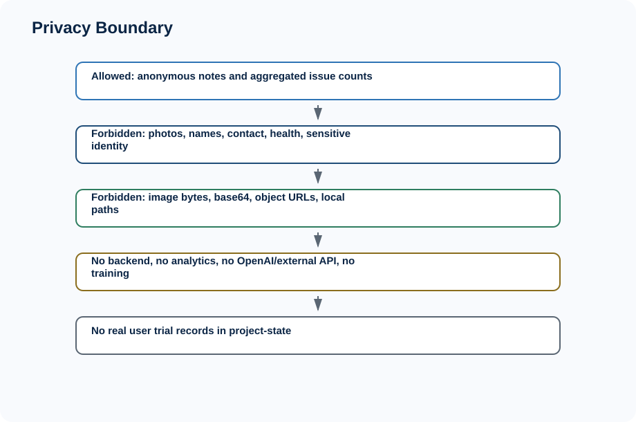

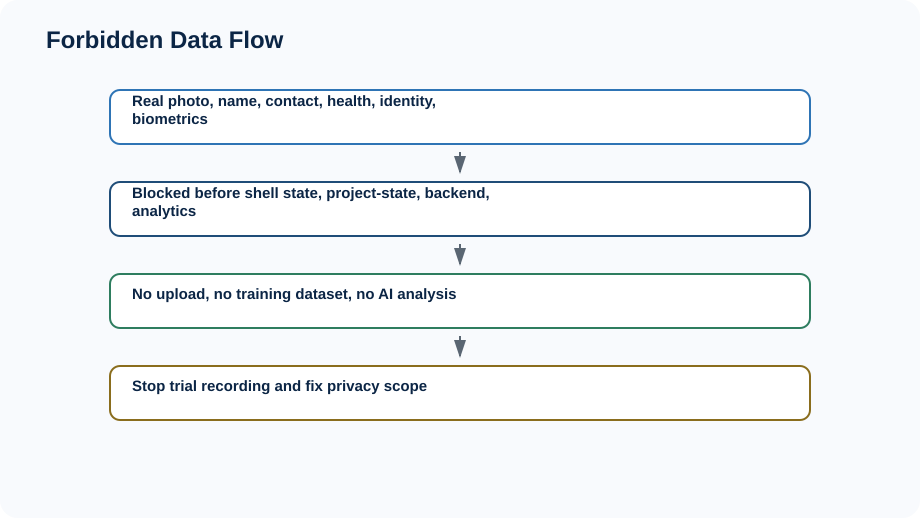

## 11. 当前不做事项

当前明确不做 production app、iOS native、React Native、Flutter、App Store / TestFlight、backend、database、accounts、cloud sync、camera、AR、OpenAI API、external CV API、training model、ecommerce / payment / community、public launch。

## 12. 当前已知限制

已知限制包括：no production user app；no real camera / AR；no backend / sync；`public/mediapipe` intentionally not committed；JPEG decode unsupported；no real deep segmentation model；User App Shell is prototype；readiness gate is not production approval；browser/mobile QA is not real device lab QA；internal trial ops is not public launch；current evidence is anonymous/mock/example/framework level unless manually run in a safe internal setting。

## 13. 测试与质量保障

质量保障覆盖 typecheck、unit tests、scoped tests、full tests、build、project:status、project:context、context-pack、browser QA、documentation recovery tests、project-state recovery tests。Phase 9J 最近记录为 471 files / 729 tests，Phase 9J scoped tests 为 10 files / 24 tests。

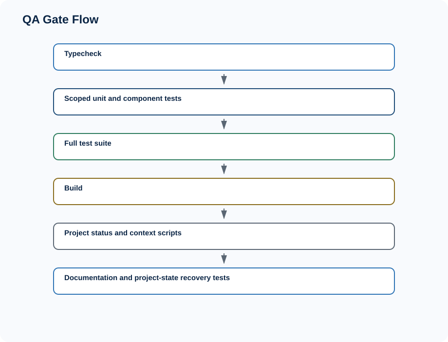

## 14. 项目状态恢复机制

恢复机制依赖 START_HERE.md、docs/status、docs/prompts、project-state/*.json、provider handoff、active task、compact handoff 和 GitHub branch / commit workflow。仓库文件是 source of truth，聊天记忆不是。

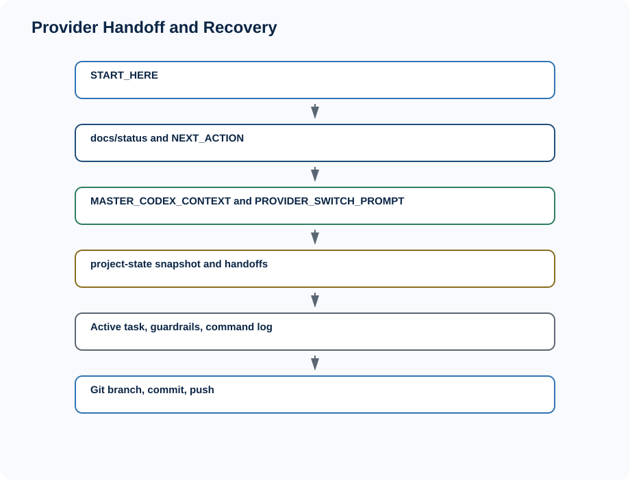

## 15. 后续路线

DOC-ILLUSTRATED 本次完成后，可进入 Phase 10A MVP Validation Plan 或按项目节奏先执行 Phase 9K Anonymous Internal Trial Evidence Round 2 Pack。后续仍不默认进入 production app。真实产品验证前还需要明确用户、指标、试用人数、成功标准、失败标准和合规边界。

