# Makeup Engine 图文版详细设计书

> 版本：DOC-ILLUSTRATED  
> 基于仓库 source of truth：Phase 9C 已完成，下一建议阶段为 Phase 9D。  
> 本文档是设计与恢复说明，不是 production app 发布说明。

## 1. 项目概述

Makeup Engine 是妆容模板生产系统。它负责把本地管理员提供的素材、视觉分析、人工修正、证据、审核、模板库、发布包和 `UserAppTemplatePackage` 消费契约组织起来，为未来独立的用户侧妆容指导 App 提供可审核的模板输入。

当前的 User App Shell 是本地 contract-driven prototype。它消费 `UserAppTemplatePackage`，用于验证妆容发现、模板详情、分步跟练、本地偏好、本地进度、隐私说明、PWA/Mobile Web MVP、内部试用准备和管理员 QA 面板。

当前路线是 React Web / PWA MVP first。当前不做 iOS 原生、React Native、Flutter、后端、数据库、账号、相机、AR、OpenAI API、外部 AI/CV API、训练、App Store/TestFlight 或正式生产发布。换句话说，本阶段明确不做 OpenAI API，也不把任何 internal trial 当成 production release。

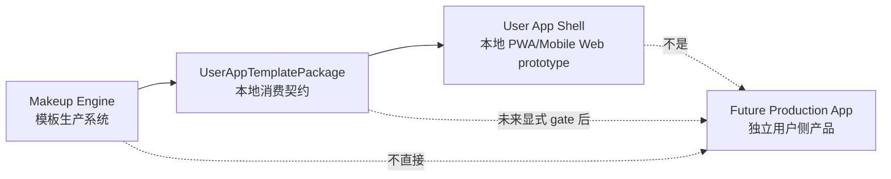


## 2. 总体目标

总体目标是建立可解释、可审核、可交接的妆容模板生产链路，并用 `UserAppTemplatePackage` 作为未来用户侧 App 的稳定消费契约。当前系统已经支持本地 PWA/Mobile Web MVP Shell、内部小范围试用准备、内容 QA、发布就绪 gate、内部试用运营、试用结果复盘和试用迭代规划。

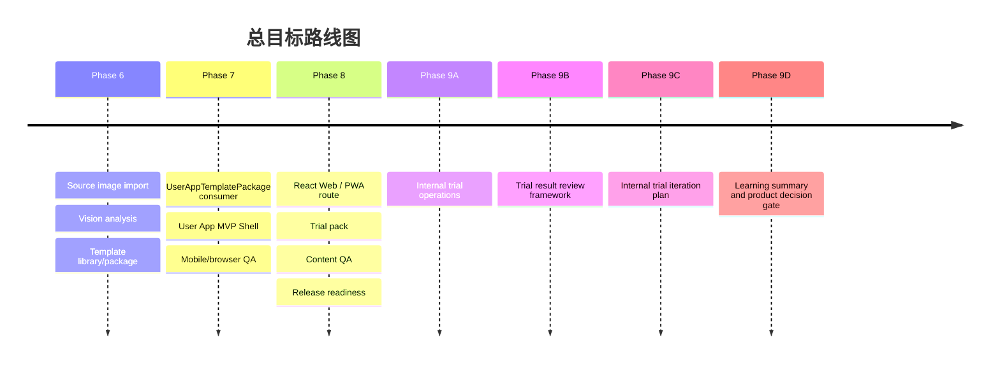

## 3. 系统总体架构

Makeup Engine 由本地确定性模块组成。Source image 进入后必须经过 artifact binding、vision analysis、mask editing、human correction、evidence、review、library、publish package 和 app contract 层级，不能直接进入用户 App 或训练数据。

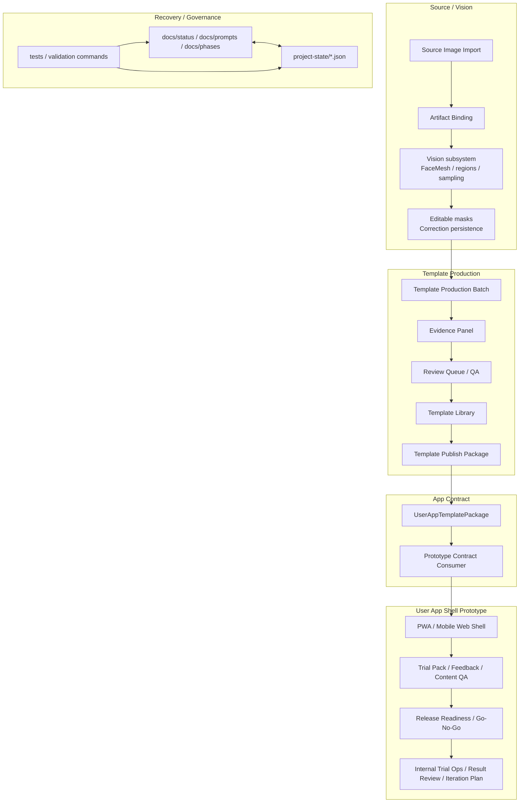

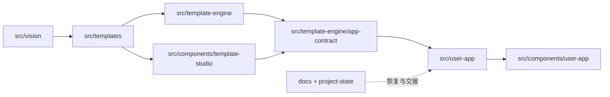

## 4. 核心数据流

端到端主链路如下。所有箭头都代表本地、显式、可检查的转换，而不是自动发布或自动训练。

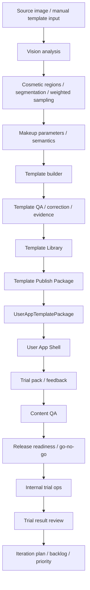

关键边界：

| 边界 | 规则 |
| --- | --- |
| `SourceImagePackage` | 不能直接进入 User App，SourceImagePackage 不是 training dataset，也不能直接成为 training dataset。 |
| `BrowserArtifactResource` | 是临时浏览器资源，不能作为 durable export。 |
| `TemplatePublishPackage` | 本地 export metadata，不是线上发布。 |
| `UserAppTemplatePackage` | 是消费契约，不是 App 本身，不可被 Shell / trial / QA 面板修改。 |
| User App Shell | 不能直接读取 `SourceImagePackage`，不能调用后端、相机、AR、OpenAI 或训练流程。 |

## 5. Vision-first 管线设计

Vision subsystem 覆盖 face detection / landmarks、MediaPipe FaceMesh provider、cosmetic regions、segmentation foundation、weighted pixel sampling、skin baseline、edge analysis、editable mask、correction persistence、dataset export / review queue、PNG image codec 和 artifact manifest。

当前限制也必须保留：未接真实深度学习 segmentation model，JPEG pixel decode intentionally unsupported，`public/mediapipe` 资源需要本地单独准备且不提交。

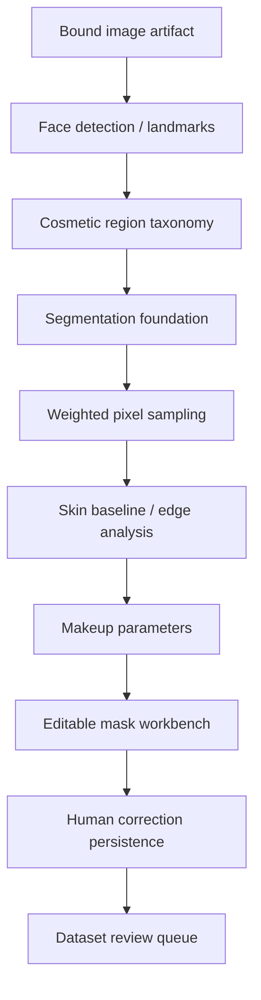

```text
Mask correction / weighted sampling 示意图

┌──────────────────────── face crop ────────────────────────┐
│                                                            │
│    [region polygon]      sample weight high                │
│       ████████             center pixels                   │
│     ██░░░░░░░░██                                           │
│    ██░ editable ░██       feathered edge = lower weight     │
│     ██░ mask  ░██                                           │
│       ████████                                             │
│                                                            │
└────────────────────────────────────────────────────────────┘
```

## 6. Template Studio 设计

Template Studio 是管理员工作台，覆盖 Source Image Intake、`TemplateAnalysisSeed`、Vision Analysis、Overlay Debug、Editable Mask Workbench、Batch Reanalysis、Evidence Panel、Dataset Panel、Review Queue、Replay Viewer、Template Library、Publish Package、Package Preview 和 User App Prototype Consumer。下面的 Template Studio 工作流展示了从素材导入到 contract 预览的管理员操作链路。


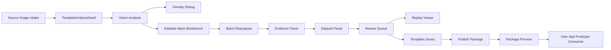

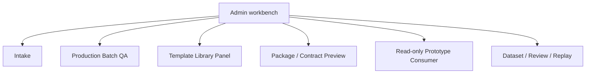

## 7. Template / App Contract 设计

核心 contract 包括 `MakeupTemplate`、`TemplateEvidence`、`HumanCorrectionDataset`、`TemplateLibraryEntry`、`TemplatePublishPackage` 和 `UserAppTemplatePackage`。兼容性验证会阻断 object URL、local absolute path、image bytes、large inline bytes 和 React state。JSON round-trip stability 是进入 User App Shell 前的基础要求。

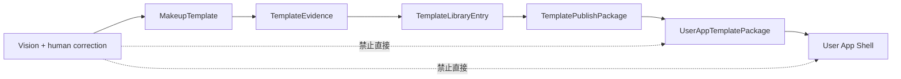

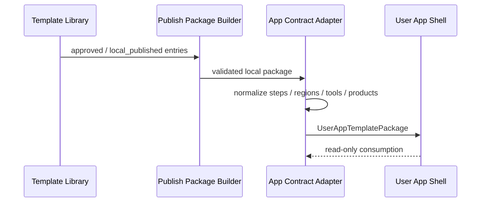

## 8. User App Shell 设计

User App Shell 是 local PWA / Mobile Web MVP Shell。普通用户路径包括 template list / detail、step-by-step guidance、tools / product suggestions、local onboarding、local preferences、local session persistence、discovery / recommendation placeholder、photo / personalization placeholder 和 privacy notice。

管理员路径包括 PWA readiness、mobile web polish、browser/mobile QA、trial pack、content QA、release readiness gate、internal trial ops、trial result review 和 trial iteration plan。


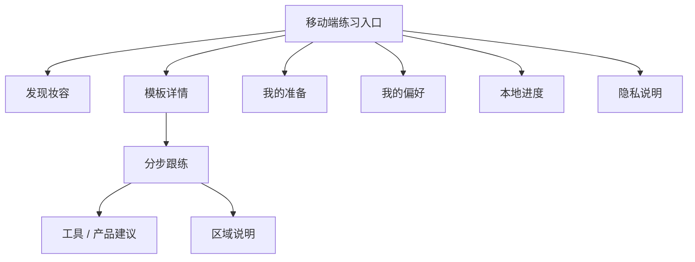

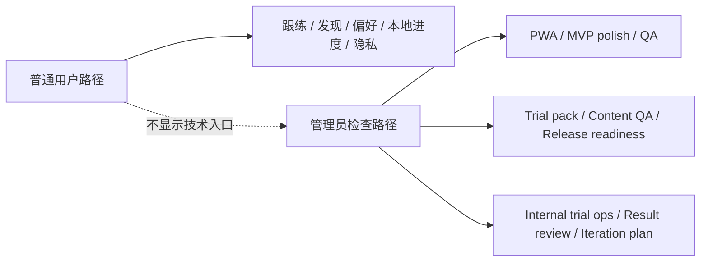

## 9. 内部试用体系设计

内部试用体系从 Phase 8C 到 Phase 9C 逐步形成闭环：

| Phase | 能力 | 说明 |
| --- | --- | --- |
| 8C | User App MVP Trial Pack | 试用任务、反馈表、trial readiness。 |
| 8D | Template Content QA | 内容可懂性、步骤可操作性、试用模板选择。 |
| 8E | MVP Release Readiness Gate | go / warning / no-go，仅用于内部试用准备。 |
| 9A | Internal Trial Operations | 参与者类型、试用流程、观察模板、结果复盘。 |
| 9B | Trial Result Review Framework | 匿名/mock 信号、问题分类、下一步决策。 |
| 9C | Internal Trial Iteration Plan | backlog、priority、workstream、下一轮行动。 |

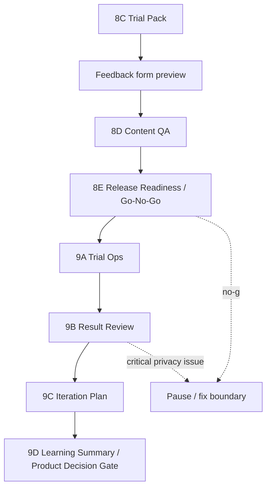

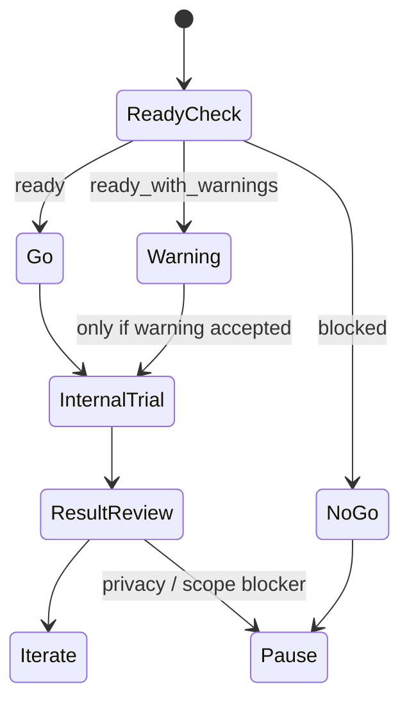

## 10. 隐私与安全边界

系统必须持续明确：

- 不采集真实用户照片。
- 不上传照片。
- 不保存 image bytes、base64、object URL、local path。
- 不保存 `faceEmbedding` 或 `biometricId`。
- 不收集健康信息、敏感身份信息、精确身份信息。
- 不写真实用户记录到 `project-state`。
- 不写 trial feedback 到 training dataset。
- 不调用 OpenAI API 或 external API。
- 不做 backend、database、analytics。

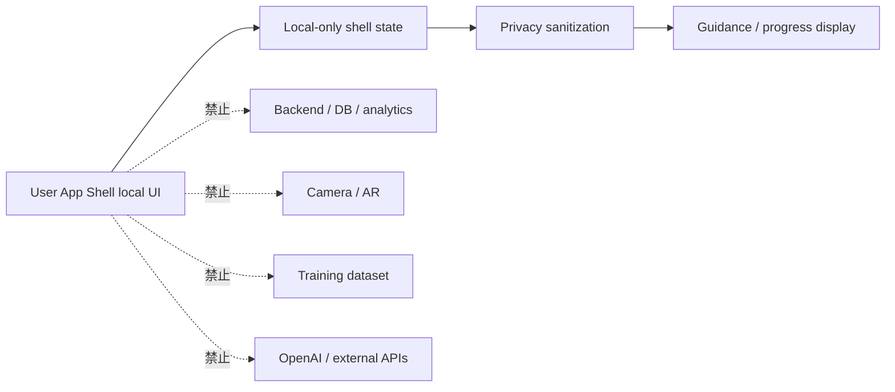

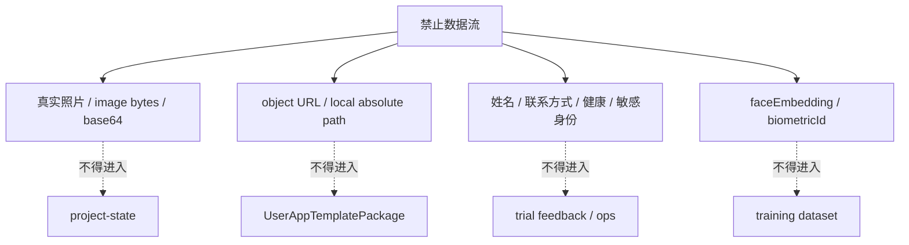

## 11. 当前不做事项

当前不做 production app、iOS native、React Native、Flutter、App Store/TestFlight、backend、database、accounts、cloud sync、camera、AR、OpenAI API、external CV API、training model、ecommerce、payment 或 community。

## 12. 当前已知限制

| 限制 | 说明 |
| --- | --- |
| No production user app | User App Shell 仍是本地 prototype。 |
| No real camera / AR | 照片与个性化只是占位，不请求权限。 |
| No backend / sync | 无账号、云同步、数据库、analytics。 |
| `public/mediapipe` not committed | MediaPipe 本地资源需要单独准备。 |
| JPEG decode unsupported | 当前像素 decode 重点是 PNG / RGBA。 |
| No real deep segmentation model | 视觉管线仍以本地规则和可编辑 mask 为核心。 |
| Readiness gate | 不是 production approval。 |
| Browser/mobile QA | 不是 real device lab QA。 |
| Internal trial ops | 不是 public launch。 |

## 13. 测试与质量保障

质量保障由类型检查、单元测试、scoped tests、full tests、build、project status/context、context pack、browser QA、documentation recovery tests 和 project-state recovery tests 组成。

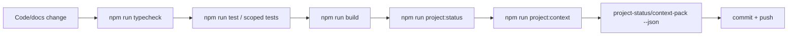

## 14. 项目状态恢复机制

恢复入口由 `START_HERE.md`、`docs/status/*`、`docs/prompts/*`、`project-state/*.json`、provider handoff、active task、skills docs、compact handoff 和 GitHub branch/commit workflow 共同组成。

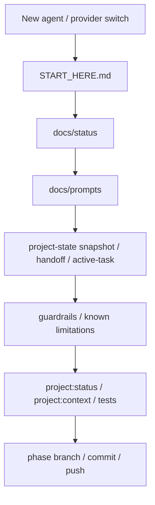

## 15. 后续路线

Phase 9C 已完成 Internal Trial Iteration Plan。下一建议阶段是 Phase 9D Internal Trial Learning Summary & Product Decision Gate。后续仍不默认进入 production app。真实用户试用或生产化之前，还需要运营、合规、隐私、数据边界、发布方式、仓库边界和是否需要 native/backend/camera/AR 的显式 gate。
