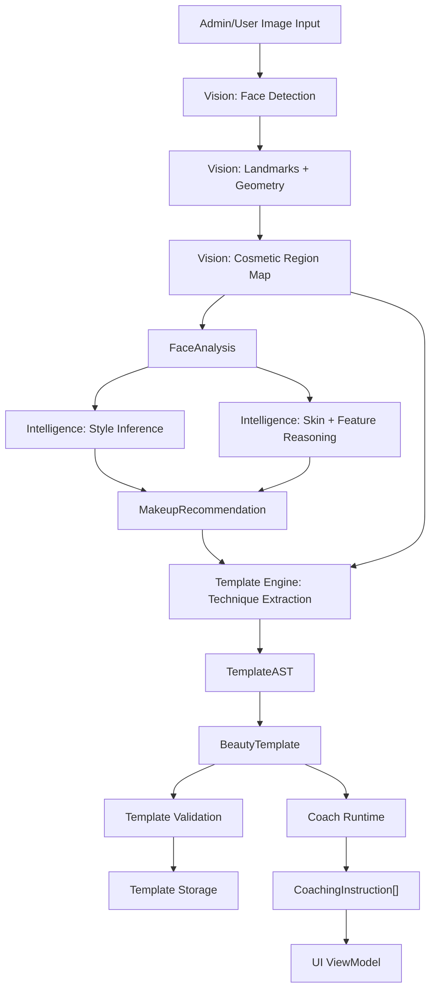

# Unified Data Flow

Status: proposed canonical data flow  
Scope: local MVP, template production, and future AI coaching runtime

## North Star

The platform should have one understandable data path:

```text
ImageInput
-> VisionInferenceResult
-> FaceAnalysis
-> MakeupStyleProfile
-> MakeupRecommendation
-> TemplateAST
-> BeautyTemplate
-> RuntimeExecutionContext
-> CoachingInstruction[]
-> UI ViewModel
```

This flow supports both current business directions:

- Template production: image input -> structured `BeautyTemplate`
- Coaching runtime: face/template input -> `CoachingInstruction[]`

The platform should not maintain separate schema worlds for "engine", "intelligence", "template", and "runtime". Those modules can have internal helpers, but public boundaries should speak the protocol.

## Full Pipeline



## Layered Contracts

### Vision -> Intelligence

Vision owns detection and measurement. Intelligence owns interpretation.

Input:

```ts
ImageInput
```

Output:

```ts
VisionInferenceResult
```

Contract:

- Vision must emit stable IDs, confidence, provenance, and warnings.
- Vision must normalize geometry into declared coordinate spaces.
- Vision should not decide what style is best.
- Vision may include `CosmeticRegionMap`, but it should describe observed makeup rather than recommend future makeup.

Required handoff:

```ts
{
  imageId: ProtocolId;
  faceDetected: boolean;
  faceAnalysis?: FaceAnalysis;
  cosmeticRegionMap?: CosmeticRegionMap;
  confidence: ConfidenceScore;
}
```

### Intelligence -> Template Engine

Intelligence owns style interpretation, suitability reasoning, and recommendation generation.

Input:

```ts
FaceAnalysis
```

Output:

```ts
MakeupRecommendation
```

Contract:

- Intelligence must preserve evidence and explanations.
- Recommendations must be structured by region, technique, product category, and expected visual effect.
- Intelligence should not persist templates.
- Intelligence should not create UI-only strings as the only output.

Required handoff:

```ts
{
  faceAnalysisId: ProtocolId;
  styleProfile: MakeupStyleProfile;
  visualGoals: VisualEffect[];
  productRecommendations: ProductRecommendation[];
  techniqueRecommendations: TechniqueRecommendation[];
}
```

### Template Engine -> Runtime

Template engine owns conversion from analysis/recommendation into reusable domain assets.

Input:

```ts
MakeupRecommendation
CosmeticRegionMap
```

Output:

```ts
BeautyTemplate
TemplateAST
```

Contract:

- Template engine must build repeatable, versioned assets.
- Template engine must distinguish observed evidence from inferred technique.
- Template engine must explain why each step exists.
- Template engine must validate templates before storage.
- Template engine should not own runtime session state.

Required handoff:

```ts
{
  template: BeautyTemplate;
  ast: TemplateAST;
  validation: TemplateValidationResult;
}
```

### Runtime -> UI

Runtime owns execution state and coaching instruction generation. UI owns display and input.

Input:

```ts
BeautyTemplate
RuntimeExecutionContext
```

Output:

```ts
CoachingInstruction[]
RuntimeEvent[]
UI ViewModel
```

Contract:

- Runtime must be deterministic for the same context and template.
- Runtime may mutate session context, but must emit immutable events.
- UI must not infer business rules from raw templates.
- UI may format and localize text, but business meaning must come from runtime output.

Required handoff:

```ts
{
  context: RuntimeExecutionContext;
  activeInstruction?: CoachingInstruction;
  progress: {
    current: number;
    total: number;
  };
}
```

## Immutable vs Mutable Data

Immutable after creation:

- raw image references
- `VisionInferenceResult`
- `FaceAnalysis`
- `CosmeticRegionMap`
- `MakeupStyleProfile`
- `MakeupRecommendation`
- `TemplateAST`
- validated or published `BeautyTemplate`
- `RuntimeEvent`
- completed `PipelineStageContext`

Mutable during workflow:

- Template Studio draft state
- admin form state
- runtime session state
- upload progress state
- review workflow metadata
- UI-only presentation state

Mutation rule:

Drafts can mutate. Inference artifacts and validated assets should version instead of mutate.

## Versioning Rules

Every persisted or replayable artifact should carry:

- `id`
- `version`
- `createdAt`
- `createdBy`
- `provenance`
- source image or upstream artifact IDs

Recommended versioning:

```text
VisionInferenceResult v0.1
FaceAnalysis v0.1
MakeupRecommendation v0.1
BeautyTemplate v0.1
TemplateAST v0.1
RuntimeEvent v0.1
```

Breaking changes require a new protocol version and an adapter plan.

## Data Provenance

Every AI-derived artifact should answer:

- Which image or template produced this?
- Which stage produced this?
- Which model/rule produced this?
- What confidence was assigned?
- What evidence supports the output?
- Was it edited by an admin after inference?

Minimum provenance:

```ts
{
  createdAt: ISODateTime;
  createdBy: 'system' | 'admin' | 'user' | 'test';
  runId?: ProtocolId;
  sourceImageId?: ProtocolId;
  model?: ModelAttribution;
}
```

## Runtime Bootstrap Flow

Current local app bootstrapping should converge on this order:

```text
React entry
-> store initialization
-> user image selection or fixture selection
-> pipeline run creation
-> vision mock/local inference
-> intelligence inference
-> recommendation/template generation
-> runtime context creation
-> UI subscribes to runtime view model
```

The UI should not instantiate low-level stage outputs itself. It should call a single application service or orchestrator and render returned state.

## Template Production Flow

Template production is the current business center.

```text
AdminUpload
-> VisionInferenceResult
-> CosmeticRegionMap
-> MakeupStyleProfile
-> TechniqueRecommendation[]
-> TemplateAST
-> BeautyTemplate draft
-> Admin edits
-> Template validation
-> Template storage
```

Admin edits should be represented as draft mutations or patch events, not as modifications to original inference artifacts.

## Coaching Flow

Coaching uses templates but should not own template production.

```text
UserFaceAnalysis
BeautyTemplate
-> suitability check
-> RuntimeExecutionContext
-> step selection
-> CoachingInstruction
-> UI view model
```

Coaching can adapt a template to a face, but adaptations should be saved as runtime session artifacts unless explicitly promoted into a new template version.

## Boundary Anti-Patterns

Avoid:

- React components importing vision output internals.
- Rule engines returning UI-only strings with no structured fields.
- Template-engine depending on Zustand.
- Runtime modifying persisted templates.
- Vision returning only labels without geometry or confidence.
- Multiple modules defining their own `FaceShape`, `SkinType`, `VisualGoal`, or `MakeupStep`.
- Compiler outputs named "render instructions" when they are actually coaching steps.

## Canonical Module Responsibilities

| Module | Should own | Should not own |
| --- | --- | --- |
| `src/vision` | raw image analysis, geometry, segmentation, cosmetic observation | style preference, template persistence, UI state |
| `src/intelligence` or future `src/beauty-knowledge` | rules, scoring, style inference, recommendations | image geometry internals, React state |
| `src/template-engine` | technique extraction, AST, template build/validation | end-user session state, generic executor abstractions |
| `src/templates` | schema, parser, validators, storage | AI inference, UI rendering |
| `src/coach-runtime` | session execution, instruction generation | template authoring, vision inference |
| `src/store` | UI/application state bridge | business decisions |
| `src/components` | presentation and interaction | schema ownership, inference rules |

## Migration Path

1. Freeze new schema creation outside protocol and `src/templates/schema`.
2. Add protocol code matching `docs/schema/unified-runtime-schema.md`.
3. Add adapters for existing `FaceFeatures`, `CosmeticAnalysisResult`, and `MakeupTemplate`.
4. Move pipeline boundaries to protocol types one boundary at a time.
5. Deprecate legacy imports with comments and lint rules.
6. Convert runtime/UI to consume view models derived from protocol artifacts.

## Test Strategy

Schema unification should be protected by:

- adapter tests for each legacy-to-protocol conversion
- pipeline contract tests at each boundary
- snapshot tests for `BeautyTemplate` and `TemplateAST`
- runtime integration tests for `BeautyTemplate -> CoachingInstruction[]`
- compile-time tests for discriminated unions and exhaustiveness

