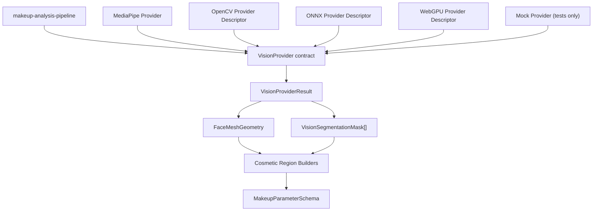

# Provider Dependency Graph

Status: Phase 1 baseline

## Dependency Direction



## Allowed Imports

Allowed:

- pipeline imports provider contract
- tests import mock provider
- concrete providers import provider contract
- cosmetic region builders import FaceMesh geometry types

Not allowed:

- business code importing `providers/mock`
- React UI importing provider internals
- template engine calling MediaPipe/OpenCV/ONNX directly
- provider implementations importing template engine

## Provider Capability Map

| Capability | MediaPipe | OpenCV | ONNX | WebGPU | Mock |
| --- | --- | --- | --- | --- | --- |
| face detection | yes | planned | planned | no | yes |
| face landmarks | yes | no | planned | no | yes |
| face mesh | yes | no | planned | no | yes |
| segmentation | later | planned | planned | planned | yes |
| cosmetic analysis | later | no | planned | planned | yes |

## Provider Runtime Rule

The app should choose a concrete provider at composition time:

```text
UI/application service
-> selected provider
-> runMakeupAnalysisPipeline({ image, provider })
```

The pipeline itself should remain deterministic and provider-agnostic.

